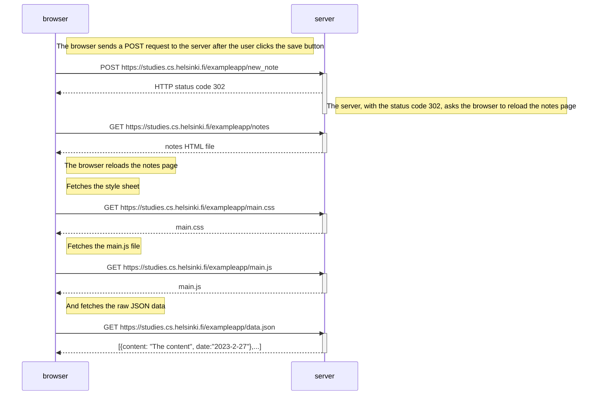

```mermaid
sequenceDiagram
  participant browser
  participant server
  
  Note right of browser: The browser sends a POST request to the server after the user clicks the save button
  browser->>server: POST https://studies.cs.helsinki.fi/exampleapp/new_note
  activate server
  server-->>browser: HTTP status code 302
  Note right of server: The server, with the status code 302, asks the browser to reload the notes page
  deactivate server

  browser->>server: GET https://studies.cs.helsinki.fi/exampleapp/notes
  activate server
  server-->>browser: notes HTML file
  deactivate server
  Note right of browser: The browser reloads the notes page
  Note right of browser: Fetches the style sheet
  browser->>server: GET https://studies.cs.helsinki.fi/exampleapp/main.css
  activate server
  server-->>browser: main.css
  deactivate server
  
  Note right of browser: Fetches the main.js file
  browser->>server: GET https://studies.cs.helsinki.fi/exampleapp/main.js
  activate server
  server-->>browser: main.js
  deactivate server
  
  Note right of browser: And fetches the raw JSON data
  browser->>server: GET https://studies.cs.helsinki.fi/exampleapp/data.json
  activate server 
  server-->>browser: [{content: "The content", date:"2023-2-27"},...]
  deactivate server
```
